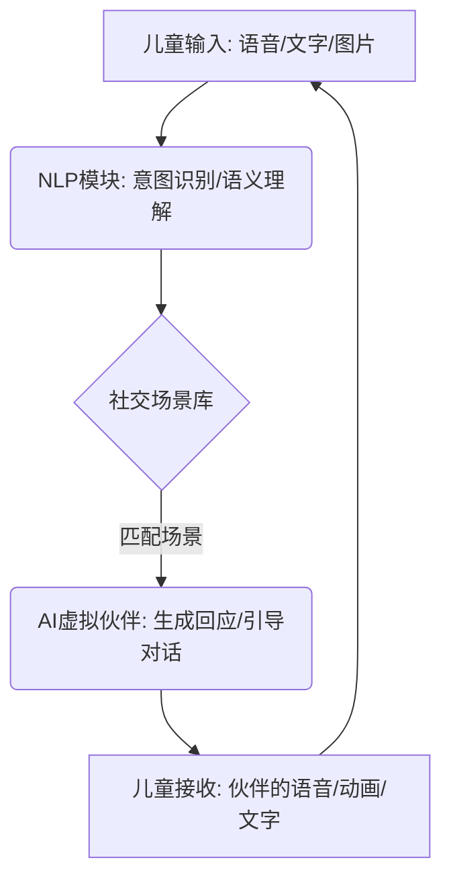
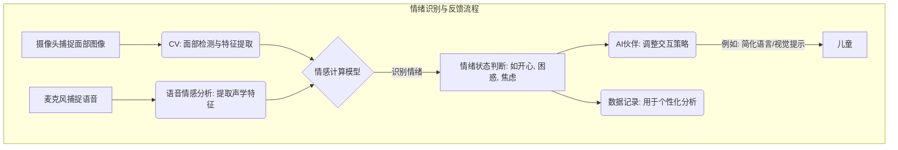
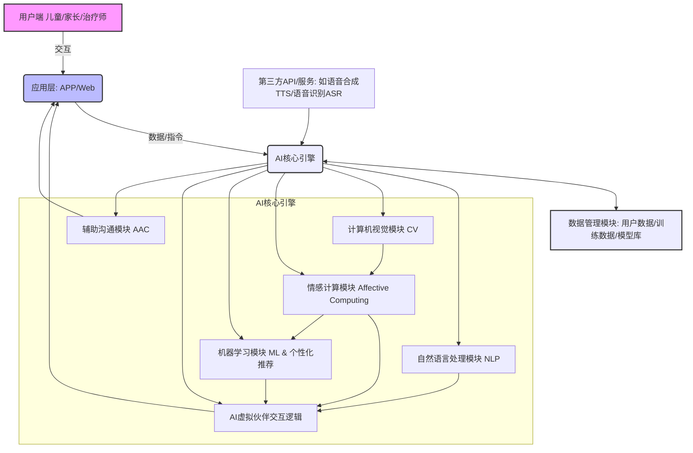

## AI之光，点亮星途 ：揭秘“智语心桥”，如何用科技为孤独症儿童架起沟通的桥梁

## 目录

1.  当科技遇见星光：AI如何为孤独症（自闭症）儿童架起沟通的桥梁？
2.  “智语心桥”：不止于“对话”，更在于“理解”与“成长”
3.  揭秘“智语心桥”的AI魔法核心
    *   AI虚拟伙伴：不止是玩伴，更是引导者
    *   情绪识别与反馈：让情感被看见，被理解
    *   个性化训练方案：因材施教，每个孩子都是独特的星
    *   辅助沟通工具：打破沉默的坚冰
4.  系统架构：科技如何编织这张“心”网？
5.  Python代码示例：AI如何“读懂”情绪的冰山一角？
6.  “智语心桥”的深远意义：从技术创新到社会价值
7.  写在最后：AI的温度，点亮每一颗孤独的星

---


我们生活在一个科技飞速发展的时代，人工智能（AI）正以前所未有的深度和广度渗透到我们生活的方方面面。从智能家居到自动驾驶，从个性化推荐到医疗诊断，AI正不断刷新着我们的认知，赋能千行百业。然而，当我们将目光投向那些被称为“星星的孩子”——孤独症（自闭症）儿童时，我们不禁会思考：AI的智慧之光，能否照亮他们独特的世界，为他们架起一座通往理解与沟通的桥梁？

**智语心桥**，一个旨在利用AI赋能孤独症儿童个性化社交与沟通的辅助系统，正为此而生。它不仅仅是一个冷冰冰的技术方案，更是一份充满温度的承诺——用科技的力量，去理解、去辅助、去点亮。

### 1. 当科技遇见星光：AI如何为孤独症（自闭症）儿童架起沟通的桥梁？

孤独症谱系障碍（ASD）的核心挑战之一在于社交互动和沟通的困难。这些孩子可能难以理解他人情绪、表达自身需求，或是在复杂的社交情境中感到迷茫和焦虑。传统的干预方法往往需要大量的人力投入，且难以做到完全的个性化和持续的动态调整。

“人工智能+特殊教育/医疗健康”的深度融合，为我们提供了全新的视角和强大的工具。想象一下，如果有一个耐心、不知疲倦、能够精准理解孩子需求的AI伙伴，随时随地陪伴他们进行社交演练、情绪学习，那将是怎样一番景象？这正是“智语心桥”想要实现的。

### 2. “智语心桥”：不止于“对话”，更在于“理解”与“成长”

“智语心桥”的核心理念，是利用AI的强大能力，为孤独症儿童打造一个安全、可控、且高度个性化的学习环境。它不仅仅是一个简单的对话机器人，更是一个集成了多种AI技术的综合辅助平台。

*   **核心目标**：通过个性化的社交场景模拟、情绪识别与表达训练、以及日常沟通辅助，帮助孤独症儿童提升社交技能，增强沟通意愿和能力，更好地融入社会。
*   **应用场景**：无论是温馨的家庭环境、专业的康复机构，还是充满关爱的特殊教育学校，“智语心桥”都能成为孩子们成长路上的得力助手。

### 3. 揭秘“智语心桥”的AI魔法核心

“智语心桥”的魔力源于多种前沿AI技术的巧妙融合，包括自然语言处理（NLP）、情感计算（Affective Computing）、计算机视觉（CV）和机器学习（ML）。

#### AI虚拟伙伴：不止是玩伴，更是引导者

系统将创造一个可定制形象（卡通、动物、拟人等）和声音的AI虚拟伙伴。这个伙伴不仅仅是“陪聊”，它更重要的角色是：

*   **引导式对话**：基于NLP技术，AI伙伴能够理解儿童的语言（包括可能不规范的表达），并以结构化、引导式的方式回应，鼓励儿童表达。
*   **模拟真实社交情境**：例如模拟“去商店买东西”、“向陌生人问路”、“和新朋友打招呼”等场景。AI伙伴会扮演不同角色，引导儿童完成互动，并根据儿童的表现提供即时反馈。



#### 情绪识别与反馈：让情感被看见，被理解

这是“智语心桥”最具温度的部分。

*   **多模态情绪识别**：利用计算机视觉（CV）技术，通过摄像头捕捉儿童的面部表情；结合语音情感分析，从儿童的语调、语速中提取情感特征。
*   **AI分析与反馈**：情感计算模型对收集到的信息进行分析，判断儿童当前的情绪状态（如开心、困惑、沮丧、焦虑等）。
*   **恰当引导**：
    *   如果识别到儿童困惑，AI伙伴会自动简化语言、放慢语速，或提供视觉化的提示（如图片、动画）。
    *   如果识别到儿童焦虑，AI伙伴会尝试用舒缓的语气安抚，或引导进行放松练习。
    *   同时，系统也会通过互动游戏、故事等方式，教导儿童识别AI伙伴或其他虚拟角色的情绪，进而迁移到对真人的情绪理解。



#### 个性化训练方案：因材施教，每个孩子都是独特的星

“智语心桥”的核心竞争力在于其“个性化”。

*   **初始评估**：家长或治疗师可以输入儿童的基础评估数据、特定需求和目标。
*   **动态调整**：机器学习（ML）算法会持续分析儿童在互动过程中的表现数据（如反应时间、正确率、情绪变化等）。
*   **智能推荐**：基于这些数据，AI动态调整训练内容的难度、类型和节奏。例如，如果孩子在“问路”场景表现良好，系统可能会引入更复杂的“团队协作”游戏；如果在情绪识别上遇到困难，系统会增加相关模块的训练频率。
*   **进度报告**：系统自动生成详细的进度报告，可视化展示儿童的成长轨迹，为家长和治疗师提供有价值的参考。

#### 辅助沟通工具：打破沉默的坚冰

对于语言表达能力较弱或无口语的儿童，系统提供了一套辅助与替代沟通（AAC）工具。

*   **图片/符号选择**：儿童可以通过点击预设的图片（PECS类似）、符号或短语来表达基本需求（如“我要喝水”、“我想玩玩具”、“我不舒服”）。
*   **语音合成输出**：选定的图片或符号可以合成为清晰的语音输出，帮助他人理解孩子的意图。

### 4. 系统架构：科技如何编织这张“心”网？

“智语心桥”的实现依赖于一个精心设计的系统架构，确保各个模块高效协同工作。



*   **用户端**：儿童直接操作的界面，以及家长/治疗师用于配置、查看报告的界面。
*   **应用层**：可以是移动App（方便家庭使用）或Web应用（方便机构管理）。
*   **AI核心引擎**：系统的大脑，集成了NLP、CV、情感计算、ML等关键AI能力模块。
*   **数据管理模块**：存储用户信息、训练数据、AI模型、以及儿童的互动记录和进度报告。
*   **第三方API/服务**：可能会集成成熟的语音识别（ASR）和语音合成（TTS）服务，以加速开发和提升体验。

### 5. Python代码示例：AI如何“读懂”情绪的冰山一角？

情感计算中的面部表情识别是一个复杂的过程，通常涉及深度学习模型。这里我们用一个极简的Python伪代码（概念性）和一段基于`opencv`和`deepface`库（如果环境允许，否则用一个更基础的haar-cascade面部检测示例）来示意其基本思想。

**概念性伪代码：**

```python
# Conceptual pseudocode for emotion recognition
def recognize_emotion_from_face(image_frame):
    # Step 1: Detect face in the image
    face_roi = detect_face(image_frame) # Region of Interest

    if face_roi is None:
        return "No face detected"

    # Step 2: Extract facial features (e.g., landmarks, HOG, embeddings)
    features = extract_facial_features(face_roi)

    # Step 3: Classify emotion using a pre-trained model
    # Models could be SVM, RandomForest, or a Deep Neural Network
    emotion_label = emotion_classifier_model.predict(features)
    
    return emotion_label

# Example usage:
# captured_image = capture_from_camera()
# detected_emotion = recognize_emotion_from_face(captured_image)
# print(f"Detected emotion: {detected_emotion}")
```

**使用OpenCV进行基础人脸检测 (更易于演示)：**

如果我们要实现一个基础的面部检测，可以用OpenCV的Haar Cascade分类器。这只是情绪识别的第一步，真正的情绪判断还需要更复杂的模型。

```python
import cv2

# 加载预训练的人脸检测器 (Haar Cascade)
# 你需要下载 'haarcascade_frontalface_default.xml' 文件
# 通常可以在OpenCV的GitHub仓库中找到
try:
    face_cascade = cv2.CascadeClassifier(cv2.data.haarcascades + 'haarcascade_frontalface_default.xml')
except Exception as e:
    print(f"Error loading cascade classifier: {e}")
    print("Please ensure 'haarcascade_frontalface_default.xml' is in the correct path or OpenCV is installed correctly.")
    face_cascade = None

def detect_faces_in_image(image_path):
    if not face_cascade:
        print("Face cascade classifier not loaded. Cannot detect faces.")
        return []
        
    img = cv2.imread(image_path)
    if img is None:
        print(f"Error: Could not read image from {image_path}")
        return []

    gray = cv2.cvtColor(img, cv2.COLOR_BGR2GRAY)
    
    # 进行人脸检测
    # scaleFactor: 表示每次图像尺寸减小的比例
    # minNeighbors: 表示构成检测目标的相邻矩形的最小个数
    # minSize: 目标的最小尺寸
    faces = face_cascade.detectMultiScale(gray, scaleFactor=1.1, minNeighbors=5, minSize=(30, 30))
    
    if len(faces) == 0:
        print("No faces detected.")
        return []
    else:
        print(f"Detected {len(faces)} face(s).")
        
    # 在图像上绘制矩形框出人脸
    for (x, y, w, h) in faces:
        cv2.rectangle(img, (x, y), (x+w, y+h), (255, 0, 0), 2) #蓝色框
        
    # 显示结果 (在实际应用中，这里会提取ROI送入情绪识别模型)
    # cv2.imshow('Detected Faces', img)
    # cv2.waitKey(0)
    # cv2.destroyAllWindows()
    
    # 为了演示，我们简单返回检测到的人脸坐标
    return faces

# --- 实际情绪识别通常会用更专业的库，例如 deepface ---
# from deepface import DeepFace
# def analyze_emotion_with_deepface(image_path):
# try:
# result = DeepFace.analyze(img_path=image_path, actions=['emotion'])
# # DeepFace.analyze returns a list of dictionaries, one for each detected face
# # For simplicity, we'll take the first result
# if isinstance(result, list) and len(result) > 0:
# dominant_emotion = result[0]['dominant_emotion']
# print(f"Dominant emotion from DeepFace: {dominant_emotion}")
# return dominant_emotion
# else: # Compatibility for older versions or different return structures
# dominant_emotion = result['dominant_emotion']
# print(f"Dominant emotion from DeepFace: {dominant_emotion}")
# return dominant_emotion
# except Exception as e:
# print(f"DeepFace analysis failed: {e}")
# return None

# --- 主程序演示基础人脸检测 ---
if __name__ == "__main__":
    # 创建一个虚拟的图片文件用于测试
    # 在实际应用中，你会用摄像头捕获的帧或者真实图片
    # For testing, you'd need a sample image, e.g., 'test_face.jpg'
    # Ensure you have an image file named 'test_face.jpg' in the same directory
    # or provide a full path to an image.
    # For this example, let's assume 'test_face.jpg' exists.
    # If not, this part will fail.
    
    # 尝试检测人脸
    # 你需要准备一张名为 "test_face.jpg" 的图片，或者修改为你的图片路径
    image_file = "test_face.jpg" 
    # To make this runnable without an actual image, we can skip if it doesn't exist
    import os
    if os.path.exists(image_file):
        detected_face_coordinates = detect_faces_in_image(image_file)
        if detected_face_coordinates is not None and len(detected_face_coordinates) > 0:
            print(f"Coordinates of detected faces: {detected_face_coordinates}")
            # emotion = analyze_emotion_with_deepface(image_file) # 如果安装了deepface
            # if emotion:
            #     print(f"The system identified the emotion as: {emotion}")
    else:
        print(f"Test image '{image_file}' not found. Skipping face detection example.")

    print("\n--- Conceptual AI Virtual Partner Interaction ---")
    def simple_nlp_intent_recognition(user_input_text):
        user_input_text = user_input_text.lower()
        if "你好" in user_input_text or "嗨" in user_input_text:
            return "greeting"
        elif "买东西" in user_input_text or "商店" in user_input_text:
            return "shopping_scenario"
        elif "谢谢" in user_input_text:
            return "gratitude"
        elif "再见" in user_input_text:
            return "farewell"
        else:
            return "unknown"

    def ai_partner_response(intent):
        if intent == "greeting":
            return "你好呀！今天想玩点什么呢？"
        elif intent == "shopping_scenario":
            return "好的，我们来玩去商店买东西的游戏吧！你想买什么？"
        elif intent == "gratitude":
            return "不客气！帮助你我很高兴。"
        elif intent == "farewell":
            return "再见啦！下次再一起玩哦！"
        else:
            return "嗯... 我好像不太明白你的意思，可以换一种说法吗？"

    # 模拟儿童与AI伙伴对话
    child_says = "你好，我想去商店买东西。"
    print(f"儿童说: {child_says}")
    intent = simple_nlp_intent_recognition(child_says)
    print(f"AI识别意图: {intent}") # 这会识别为greeting，因为"你好"在前
    response = ai_partner_response(intent)
    print(f"AI伙伴回应: {response}")

    child_says_2 = "我们去商店买苹果。"
    print(f"儿童说: {child_says_2}")
    intent_2 = simple_nlp_intent_recognition(child_says_2)
    print(f"AI识别意图: {intent_2}")
    response_2 = ai_partner_response(intent_2)
    print(f"AI伙伴回应: {response_2}")

```
**代码解释：**
1.  **基础人脸检测 (OpenCV)**:
    *   `cv2.CascadeClassifier`: 加载OpenCV预训练的Haar Cascade分类器模型，专门用于检测人脸。`haarcascade_frontalface_default.xml` 是模型文件。
    *   `cv2.imread` 和 `cv2.cvtColor`: 读取图像并将其转换为灰度图像，因为人脸检测通常在灰度图上进行。
    *   `face_cascade.detectMultiScale`: 这是执行人脸检测的核心函数。它会在不同尺度上扫描图像以找到人脸。参数如`scaleFactor`、`minNeighbors`和`minSize`用于调整检测的灵敏度和准确性。
    *   `cv2.rectangle`: 如果检测到人脸，就在人脸周围绘制一个矩形框。
    *   **注意**: 这仅仅是“检测”到人脸的位置。要识别“情绪”，还需要将检测到的人脸区域（ROI）送入专门的情绪识别模型（通常是深度学习模型，如使用Keras/TensorFlow/PyTorch构建的CNN，或使用`deepface`这样的库）。
2.  **简单NLP意图识别与AI伙伴回应**:
    *   `simple_nlp_intent_recognition`: 这是一个非常基础的基于关键词的意图识别函数。它将用户输入转换为小写，然后检查是否包含特定的关键词来判断用户的意图（如打招呼、购物等）。
    *   `ai_partner_response`: 根据识别到的意图，这个函数生成一个相应的AI伙伴的回应。
    *   **实际应用中**: NLP模块会复杂得多，可能会使用词嵌入（Word Embeddings）、循环神经网络（RNNs）或Transformer模型来更准确地理解上下文和语义，而不仅仅是关键词匹配。

这段代码只是一个非常简化的示意。真实的情绪识别系统会使用更复杂的深度学习模型，这些模型在大规模标注数据集上进行训练，能够识别多种细微的面部表情组合对应的复杂情绪。

### 6. “智语心桥”的深远意义：从技术创新到社会价值

“智语心桥”的意义远不止于一个技术产品：

1.  **显著的社会价值**：直接回应了孤独症儿童家庭和社会的痛点，为特殊教育领域提供了创新的AI解决方案。这完美契合了国家推动“人工智能+”深度融合经济社会各领域发展的战略方向。
2.  **技术可行性与创新性**：虽然情感计算等领域仍有挑战，但NLP、CV、ML等基础AI技术已相对成熟，有丰富的开源工具和模型可供借鉴。项目的核心创新在于将这些技术巧妙地“个性化”应用于孤独症儿童的社交与沟通训练，区别于传统固化的训练模式。
3.  **强大的可落地性**：项目可以从APP或Web应用起步，与康复机构、特殊学校合作进行试点验证，收集真实反馈，不断迭代优化。未来商业模式可考虑SaaS订阅服务、与教育硬件厂商合作预装等。
4.  **学科交叉的典范**：完美体现了新文科（社会工作、教育学、心理学）与新工科（人工智能）的交叉融合，培养跨学科的复合型人才。

### 7. 写在最后：AI的温度，点亮每一颗孤独的星

“智语心桥”不仅仅是一个项目名称，它更像一个承诺，一个愿景。它试图用AI的逻辑与效率，去触达和理解那些通常难以用语言表达的内心世界。科技的发展不应仅仅追求效率和利润，更应关注其人文价值和社会责任。

我们有理由相信，随着AI技术的不断进步和更多有识之士的投入，“智语心桥”这样的项目能够不断完善，真正成为孤独症儿童成长路上的好伙伴，帮助他们更好地理解世界、表达自己，最终自信地走向更广阔的未来。AI的温度，有能力，也应当去点亮每一颗独特而孤独的“星星”。
