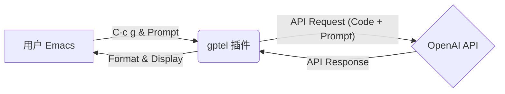
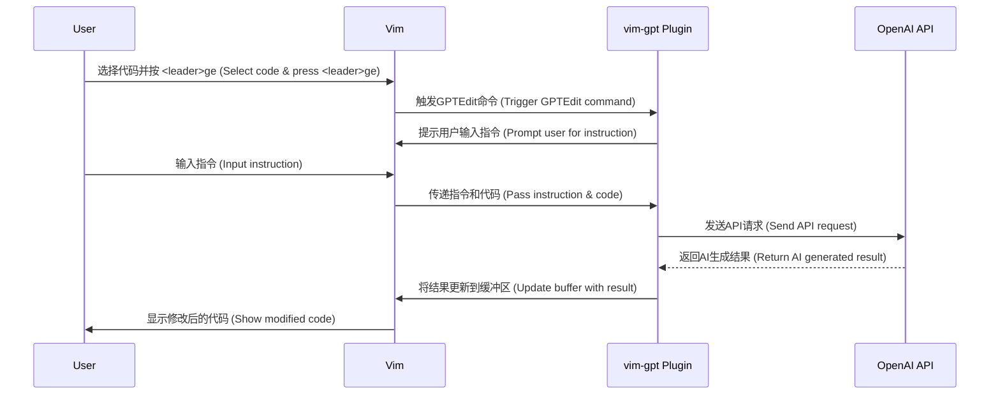

# 当Emacs与Vim插上AI翅膀，老炮儿也能玩转智能编程

# 目录

*   引言：老派编辑器的新生
*   为什么Emacs和Vim依然屹立不倒？
*   Emacs的AI聚变：当Lisp遇见智能
    *   与LLM对话：`gptel`的魔力
    *   智能补全：Copilot的无缝融入
    *   代码洞察：LSP与AI的协同
*   Vim的AI增强：模式编辑的智能进化
    *   LLM驱动的操作 (`vim-gpt`)
    *   Copilot加持：智能建议触手可及
    *   深度分析：`coc.nvim`与AI的力量
*   实战演练：AI驱动的开发流程
    *   Emacs中的AI辅助重构
    *   Vim + Copilot快速原型开发
*   高阶玩法：打造个性化AI编程环境
    *   拥抱本地模型：隐私与离线能力
    *   领域专家：定制你的AI助手
    *   智能审查：AI成为你的代码评审员
*   挑战与应对：平稳驶入AI时代
*   未来已来：Emacs、Vim与AI的无限可能
*   结语：经典永恒，智能赋能

---


在科技浪潮滚滚向前的今天，我们似乎总在追逐下一个“颠覆性”工具。然而，在开发者工具箱的深处，两位“老古董”——Emacs和Vim，不仅没有被遗忘，反而正在经历一场由人工智能驱动的惊人复兴。诞生于上世纪70年代和90年代的它们，凭借其无与伦比的哲学和社区力量，正积极拥抱AI，证明经典也能引领潮流。

这篇文章将带你深入探索，如何为这两位编辑器界的常青树注入AI的智慧，让它们在现代开发工作流中不仅不落伍，甚至能提供超乎想象的效率和洞察力。无论你是Emacs或Vim的忠实拥趸，还是对传统工具与前沿AI结合充满好奇的开发者，这里都有你想要的答案和启发。

### 为什么Emacs和Vim依然屹立不倒？

在谈论如何用AI“魔改”之前，我们得先明白，为什么这些看似“过时”的编辑器，至今仍能俘获大批死忠粉？答案很简单：**极致效率、无限定制、坚实可靠**。

1.  **键盘驱动的效率**：一旦你掌握了它们的精髓，双手几乎无需离开键盘，编辑、导航、编译、调试一气呵成，这种“心流”般的编码体验是现代IDE难以复制的。
2.  **“万物皆可改”的定制性**：Emacs的Elisp和Vim的Vimscript赋予了用户近乎无限的自由，你可以将编辑器打造成完全符合个人习惯的专属工作站。从主题到工作流，一切皆可定制。
3.  **跨平台与稳定性**：无论你身处Linux、macOS还是Windows，甚至在远程服务器的终端里，它们都能提供一致、稳定的体验。
4.  **活跃社区与开放架构**：这或许是最关键的一点。强大的社区和开放的设计哲学，使得它们能够像海绵一样吸收新技术，AI便是其中最耀眼的新浪潮。

正是这些特质，为AI技术的融入提供了肥沃的土壤。

### Emacs的AI聚变：当Lisp遇见智能

Emacs，这个被戏称为“伪装成编辑器的操作系统”，其核心优势在于强大的可扩展性。Elisp让集成AI能力变得顺理成章。

#### 与LLM对话：`gptel`的魔力

`gptel` 插件是连接Emacs与大型语言模型（如GPT系列）的桥梁。配置简单：

```elisp
;; 安装并配置 gptel
(use-package gptel
  :ensure t ;; 确保包已安装
  :config
  ;; 请替换成你的API Key
  (setq gptel-api-key (getenv "OPENAI_API_KEY")) 
  ;; 设置默认交互模式，例如 Org Mode
  (setq gptel-default-mode 'org-mode) 
  :bind
  ;; 绑定快捷键 C-c g 来发送查询
  ("C-c g" . gptel-send)) 
```

**代码解释**：
这段Elisp代码使用Emacs的包管理系统`use-package`来安装和配置`gptel`。
-   `:ensure t` 确保`gptel`包会被自动安装（如果尚未安装）。
-   `:config` 部分设置了API Key（建议使用环境变量存储）和默认的交互格式（Org Mode易于组织内容）。
-   `:bind` 将`C-c g`快捷键绑定到`gptel-send`函数，方便随时调用AI。

配置完成后，你可以选中一段代码，按下`C-c g`，然后输入你的问题（例如：“解释这段代码”、“重构这段代码”），AI的回答会直接插入或显示在新的Buffer中。

**系统架构示意：**



#### 智能补全：Copilot的无缝融入

GitHub Copilot已经成为许多开发者的编程“副驾驶”。通过`copilot.el`，Emacs也能拥有这份智能。

```elisp
;; 安装并配置 Copilot
(use-package copilot
  ;; 从指定仓库安装
  :straight (:host github :repo "zerolfx/copilot.el" :files ("dist" "*.el")) 
  :ensure t
  ;; 在编程模式启动时自动激活Copilot
  :hook (prog-mode . copilot-mode) 
  :config
  ;; 自定义快捷键 (示例)
  (define-key copilot-mode-map (kbd "<tab>") 'copilot-accept-completion) ;; 使用Tab接受建议
  (define-key copilot-mode-map (kbd "M-n") 'copilot-next-completion)    ;; Meta+n 查看下一个建议
  (define-key copilot-mode-map (kbd "M-p") 'copilot-previous-completion));; Meta+p 查看上一个建议
```

**代码解释**：
-   这里使用`straight.el`作为包管理器示例，指定从GitHub仓库安装`copilot.el`。
-   `:hook (prog-mode . copilot-mode)` 表示在进入任何编程模式（如`python-mode`, `js-mode`等）时，自动启用Copilot。
-   `:config` 部分定义了快捷键，方便接受或切换Copilot提供的代码建议。你可以根据自己的习惯修改。

当你编写代码或注释时，Copilot会实时提供灰色字体的建议，按下绑定的快捷键即可采纳。

#### 代码洞察：LSP与AI的协同

语言服务器协议（LSP）为编辑器提供了类IDE的功能。结合AI增强的LSP服务器（如某些Python或TypeScript服务器），Emacs的代码分析能力如虎添翼。

```elisp
;; 配置LSP基础环境
(use-package lsp-mode
  :ensure t
  :commands lsp
  :hook ((python-mode . lsp) ;; 为Python模式启用LSP
         (js-mode . lsp))   ;; 为JavaScript模式启用LSP
  :config
  (setq lsp-prefer-flymake nil)) ;; 可选，根据个人喜好选择检查器

;; 配置LSP UI增强
(use-package lsp-ui
  :ensure t
  :commands lsp-ui-mode
  :config
  (setq lsp-ui-doc-enable t) ;; 启用文档悬浮提示
  (setq lsp-ui-doc-position 'at-point)) ;; 文档显示在光标处

;; 配置特定语言的LSP服务器，以Python为例 (Pyright)
(use-package lsp-pyright
  :ensure t
  :hook (python-mode . (lambda ()
                          (require 'lsp-pyright)
                          (lsp)))) ;; 确保Pyright在Python模式启动时加载
```

**代码解释**：
-   `lsp-mode`是核心包，负责与LSP服务器通信。
-   `lsp-ui` 提供了更友好的界面，如悬浮文档、侧边栏诊断等。
-   `lsp-pyright` 是针对Python的LSP服务器Pyright的Emacs客户端。
-   通过`:hook`，可以在打开特定类型文件时自动启动LSP服务。

AI驱动的LSP服务器能提供更智能的错误检测、上下文感知的代码补全（有时会结合Copilot）、以及更精准的代码导航和重构建议。

### Vim的AI增强：模式编辑的智能进化

Vim以其高效的模式编辑和轻量级著称。通过插件，AI同样能融入这套哲学。

#### LLM驱动的操作 (`vim-gpt`)

`vim-gpt` (或类似插件) 允许你在Vim中直接与LLM交互。

```vim
" 使用 vim-plug 管理插件
Plug 'aduros/vim-gpt' 

" 初始化插件管理器 (如果还没做)
call plug#begin('~/.vim/plugged')
" ... 其他插件 ...
Plug 'aduros/vim-gpt'
call plug#end()

" 配置API Key和模型
let g:gpt_api_key = $OPENAI_API_KEY " 从环境变量读取API Key
let g:gpt_default_model = 'gpt-4-turbo-preview' " 选择模型

" 自定义快捷键 (Normal模式)
nnoremap <leader>ge :GPTEdit<CR> " 编辑选中内容
nnoremap <leader>gc :GPTChat<CR> " 打开聊天窗口
vnoremap <leader>ge :GPTEdit<CR> " Visual模式下编辑选中内容
```

**代码解释**：
-   使用`vim-plug`（或其他插件管理器如Vundle, Dein）安装`vim-gpt`。
-   `let g:gpt_api_key = $OPENAI_API_KEY` 从环境变量中安全地读取API Key。
-   `let g:gpt_default_model` 设置默认使用的AI模型。
-   `nnoremap` 和 `vnoremap` 定义了Normal模式和Visual模式下的快捷键。`<leader>`通常是`\`键。

现在，你可以选中代码，按下`<leader>ge`，然后输入指令（如：“重构这段代码以提高效率”），插件会将结果替换选区或在分屏中显示。

**交互流程示意：**



#### Copilot加持：智能建议触手可及

Vim同样可以无缝集成GitHub Copilot。

```vim
" 使用 vim-plug 安装 Copilot
Plug 'github/copilot.vim'

" 配置 (通常无需太多配置，但可按需调整)
" 确保Node.js已安装，Copilot需要它
" let g:copilot_node_command = '/path/to/your/node' " 如需指定Node路径

" 启用Copilot (默认通常是启用的)
let g:copilot_enabled = 1

" 自定义快捷键 (Insert模式)
imap <silent><script><expr> <C-Space> copilot#Accept("\<CR>")  " Ctrl+Space接受建议
let g:copilot_no_tab_map = 1 " 禁用默认的Tab映射，避免冲突
imap <C-N> <Plug>(copilot-next) " Ctrl+N 查看下一个建议
imap <C-P> <Plug>(copilot-previous) " Ctrl+P 查看上一个建议
```

**代码解释**：
-   安装`copilot.vim`插件。
-   确保Node.js环境可用，Copilot后端依赖它。
-   `imap` 定义了Insert模式下的快捷键。`<silent><script><expr>` 允许更复杂的映射。这里用`Ctrl+Space`接受建议，`Ctrl+N/P`切换建议。
-   `let g:copilot_no_tab_map = 1` 是一个好习惯，防止Copilot默认的Tab映射干扰你的其他Tab设置。

当你输入代码或注释时，Copilot的建议会以虚拟文本形式出现，使用快捷键即可轻松互动。

#### 深度分析：`coc.nvim`与AI的力量

`coc.nvim` (Conquer of Completion) 是一个强大的Vim/Neovim补全框架，支持LSP，并且可以通过扩展集成AI功能。

```vim
" 使用 vim-plug 安装 coc.nvim
Plug 'neoclide/coc.nvim', {'branch': 'release'}

" 安装coc扩展 (在Vim/Neovim命令行中执行)
" :CocInstall coc-pyright coc-json coc-tsserver coc-copilot

" 基础配置 (示例)
let g:coc_global_extensions = ['coc-pyright', 'coc-json', 'coc-tsserver', 'coc-copilot'] " 管理安装的扩展

" 快捷键配置 (Normal模式)
nmap <silent> gd <Plug>(coc-definition) " 跳转到定义
nmap <silent> gy <Plug>(coc-type-definition) " 跳转到类型定义
nmap <silent> gi <Plug>(coc-implementation) " 跳转到实现
nmap <silent> gr <Plug>(coc-references) " 查找引用

" 使用 K 显示文档/悬浮信息
nnoremap <silent> K :call <SID>show_documentation()<CR>
function! s:show_documentation()
  if (index(['vim','help'], &filetype) >= 0)
    execute 'h '.expand('<cword>')
  elseif (coc#rpc#ready())
    call CocActionAsync('doHover')
  else
    execute '!' . &keywordprg . " " . expand('<cword>')
  endif
endfunction
```

**代码解释**：
-   安装`coc.nvim`主插件。
-   通过`:CocInstall`命令安装需要的`coc`扩展，例如`coc-pyright` (Python LSP), `coc-tsserver` (TypeScript/JavaScript LSP), 甚至`coc-copilot` (另一种集成Copilot的方式)。
-   配置常用快捷键进行代码导航。
-   自定义`K`键，使其在代码中调用`coc#rpc#ready()`检查`coc`服务是否就绪，就绪则显示LSP提供的悬浮信息（通常包含类型、文档等），否则回退到默认行为。

`coc.nvim` 结合AI增强的LSP服务器和Copilot扩展，可以在Vim中提供非常接近现代IDE的智能开发体验。

### 实战演练：AI驱动的开发流程

理论讲完了，让我们看看实际场景中AI如何助力。

#### Emacs中的AI辅助重构

假设你有一段看起来冗余或效率低下的Elisp代码，想让AI帮忙优化：

1.  选中需要重构的代码区域。
2.  按下之前绑定的`gptel`快捷键（如`C-c g`）。
3.  在弹出的迷你缓冲区输入提示，例如：“请重构以下Elisp代码，使其更简洁、高效，并添加必要的注释。”
4.  `gptel`会将代码和你的指令发送给AI。
5.  AI返回的建议会插入到一个新的Buffer或当前Buffer中（取决于你的配置）。你可以比较、采纳或进一步修改。

#### Vim + Copilot快速原型开发

需要快速实现一个Python函数来下载网页内容？

1.  在Vim中打开一个新的Python文件。
2.  输入一行注释描述你的需求：
    ```python
    # Function to download HTML content from a given URL using requests library
    ```
3.  按下回车，或者稍等片刻，Copilot很可能会自动建议整个函数的实现框架，甚至包括错误处理：
    ```python
    import requests

    def download_html(url):
        """Downloads HTML content from a given URL."""
        try:
            response = requests.get(url, timeout=10) # 添加超时
            response.raise_for_status() # 检查HTTP错误
            return response.text
        except requests.exceptions.RequestException as e:
            print(f"Error downloading {url}: {e}")
            return None

    # Example usage:
    # html_content = download_html("https://example.com")
    # if html_content:
    #     print(html_content[:200]) # 打印前200个字符
    ```
4.  你可以使用配置的快捷键（如`Ctrl+Space`或`Tab`）接受建议，然后根据需要微调。这个过程极大地加速了从想法到初步代码的转化。

### 高阶玩法：打造个性化AI编程环境

集成的脚步不止于此，我们可以探索更深层次的定制。

#### 拥抱本地模型：隐私与离线能力

对于数据隐私敏感或需要在无网络环境下工作的场景，可以在本地运行开源大模型（如Llama, Mistral等），并通过Emacs/Vim插件（如`ollama.el`, `vim-llm`等）进行交互。这需要一定的硬件资源和配置，但提供了完全的控制权。

**Emacs本地LLM调用示例 (概念性)**

```elisp
;; 假设已安装并配置好与本地Ollama服务交互的插件 ollama.el
(defun my/ask-local-llm-about-code ()
  "使用本地运行的LLM解释选中的代码"
  (interactive)
  (if (use-region-p)
      (let ((code (buffer-substring-no-properties (region-beginning) (region-end))))
        (ollama-ask (format "请解释以下代码:\n```\n%s\n```" code) 
                    :model "llama3:latest" ;; 指定本地模型
                    :stream t ;; 流式输出
                    ))
    (message "No region selected")))

(global-set-key (kbd "C-c C-l") 'my/ask-local-llm-about-code)
```

#### 领域专家：定制你的AI助手

你可以为特定的任务或编程语言创建“专家级”AI助手。通过精心设计的系统提示（System Prompt）或结合RAG（Retrieval-Augmented Generation）技术，让AI在特定领域提供更精准的帮助。

例如，在Emacs中创建一个专门用于调试Python代码的函数：

```elisp
(defun my/python-debug-helper ()
  "使用AI分析当前Python代码中的潜在错误"
  (interactive)
  (when (derived-mode-p 'python-mode)
    (let ((code (buffer-string))
          (system-prompt "你是一个经验丰富的Python调试专家。请分析以下Python代码，找出可能的运行时错误、逻辑错误或潜在的性能瓶颈，并给出修复建议。"))
      (gptel-send code :system-prompt system-prompt)))
  (unless (derived-mode-p 'python-mode) (message "Not in a Python buffer")))

(add-hook 'python-mode-hook 
          (lambda () 
            (local-set-key (kbd "C-c C-d") 'my/python-debug-helper)))
```

#### 智能审查：AI成为你的代码评审员

利用AI进行初步的代码审查，检查风格、潜在错误和改进点。

**Vim中的AI Code Review命令 (概念性)**

```vim
command! -range=% AIRview :call PerformAICodeReview(<line1>, <line2>)

function! PerformAICodeReview(line1, line2)
  let code_selection = getline(a:line1, a:line2)
  let code_text = join(code_selection, "\n")
  let prompt = "请像资深工程师一样审查以下代码。关注代码风格、潜在bug、性能问题和安全漏洞。提供具体的改进建议。\n\n```" . &filetype . "\n" . code_text . "\n```"
  
  " 假设有一个名为 GPTReview 的函数或命令来处理这个prompt
  " 例如使用 vim-gpt 或自定义脚本调用API
  " GPTReview prompt 
  echo "发送代码进行AI审查..." 
  " 此处应调用实际的AI交互函数，并将结果显示在新窗口或分屏中
  " 例如: call GPTExecute(prompt, {'output': 'split'})
endfunction
```

### 挑战与应对：平稳驶入AI时代

集成AI并非一帆风顺，挑战与机遇并存：

1.  **性能延迟**：与云端AI交互可能引入延迟。
    *   **对策**：使用异步请求避免阻塞编辑器；优化Prompt减少生成时间；考虑本地模型处理简单任务。
2.  **上下文限制**：LLM的上下文窗口有限，无法理解整个项目。
    *   **对策**：插件通常会智能选取相关代码片段（如当前文件、函数、类）；使用Embedding和向量数据库进行更高级的上下文管理（RAG）。
3.  **隐私安全**：将代码发送给第三方服务引发担忧。
    *   **对策**：优先选择信誉良好、有明确隐私政策的服务；使用本地模型；配置插件过滤敏感信息。
4.  **过度依赖**：警惕AI扼杀独立思考和学习。
    *   **对策**：将AI视为辅助工具，而非替代品；主动理解AI建议背后的原理；保持批判性思维。

### 未来已来：Emacs、Vim与AI的无限可能

这仅仅是开始。未来，我们可以期待：

1.  **更深度的集成**：AI不仅是外部调用，而是能理解编辑器内部状态，提供更情境化的帮助。
2.  **多模态能力**：通过语音命令编程，或让AI分析代码截图、设计图。
3.  **个性化与自适应**：AI学习你的编码风格和偏好，提供量身定制的建议。
4.  **AI驱动的自动化**：自动生成测试用例、文档，甚至根据高级描述自动完成整个模块。
5.  **协作智能**：AI作为真正的编程伙伴，参与架构讨论和决策。

### 结语：经典永恒，智能赋能

Emacs和Vim这两位编辑器界的“老兵”，非但没有在AI时代褪色，反而借助AI的力量，展现出前所未有的活力。它们的核心哲学——可扩展性、可定制性和效率至上——与AI技术的赋能特性完美契合。

将AI融入Emacs和Vim，不是简单的功能叠加，而是一场深刻的化学反应，它让我们这些坚守经典的“老炮儿”也能站在智能编程的最前沿。这不仅仅是关于工具的进化，更是关于我们如何利用智慧，不断突破软件开发的边界。所以，不妨现在就动手，为你的Emacs或Vim插上AI的翅膀，探索属于你的智能编程新境界吧！

---
