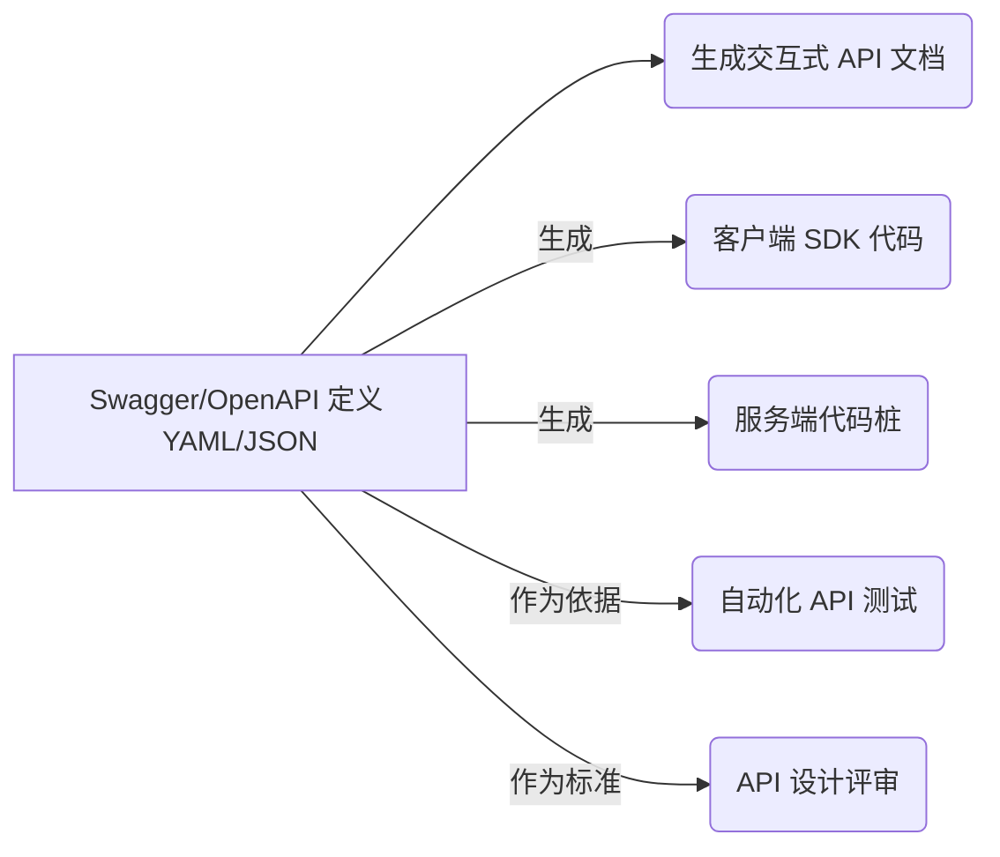
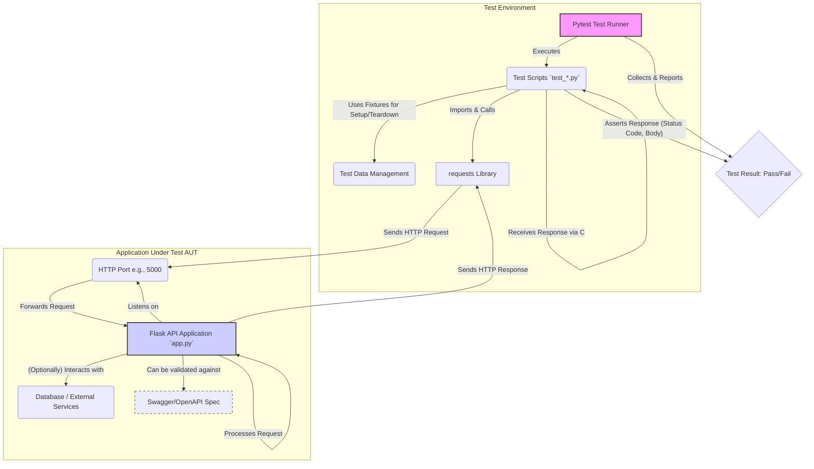
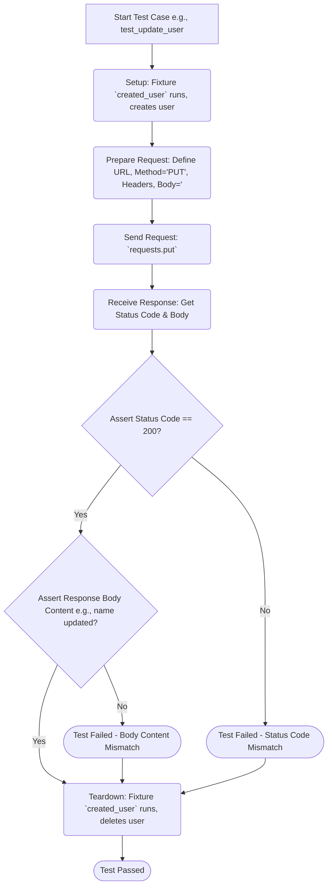
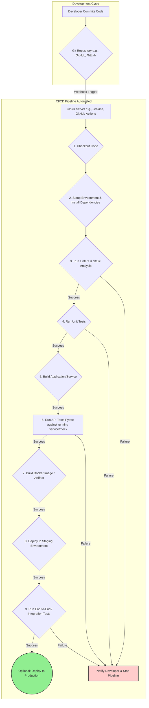

# 告别手动测试！Python、Flask 与 Swagger 联手，打造 AI 应用的坚固 API 后盾

# 目录

1.  引言：为何 API 测试在 AI 时代如此重要？
2.  Swagger (OpenAPI)：不止于文档，更是 API 的契约
3.  Flask：构建轻量级 Python API 的利器
4.  实战演练：构建一个简单的 Flask 用户 API
5.  基础测试：使用 `requests` 库与 API 对话
6.  效率升级：拥抱 `pytest` 测试框架
7.  可视化：理解测试架构与流程
8.  在Flask中集成Swagger UI
9.  超越基础：模拟、Mock 与 CI/CD 集成
10. 总结：构建健壮 AI 应用的基石

---


## 1. 引言：为何 API 测试在 AI 时代如此重要？

在当今这个由人工智能驱动的时代，系统变得越来越复杂，尤其是那些依赖微服务架构或将机器学习模型封装成服务的应用。在这些系统中，API（应用程序接口）不仅仅是连接点，它们是整个架构的生命线，是不同服务间沟通、数据流转的桥梁。

想象一下，你精心训练了一个先进的自然语言处理模型，并通过 API 对外提供摘要生成服务。如果这个 API 在面对高并发请求时响应缓慢、超时，或者返回了格式混乱、内容错误的结果，那么无论你的模型本身多么智能，最终用户的体验都将是一场灾难，甚至可能导致关键业务流程中断。因此，**健壮、可靠、自动化的 API 测试**不再是软件开发流程中的“可选项”，而是构建高质量、可信赖 AI 应用的**绝对必需品和基石**。

今天，我想结合我在 AI 系统工程和软件开发中的实战经验，带大家深入探讨如何巧妙地利用 Python 生态中几款强大的“瑞士军刀”——轻量级 Web 框架 Flask、行业标准的 API 描述规范 Swagger (OpenAPI)，以及功能强大的测试框架 Pytest，共同构建一套高效、可维护的 API 自动化测试流程。无论你是专注于算法的 AI 工程师、负责后端服务的开发者，还是专业的测试工程师，相信这篇文章都能为你点亮 API 测试的新思路。

## 2. Swagger (OpenAPI)：不止于文档，更是 API 的契约

在我们撸起袖子开始编写测试代码之前，必须先解决一个根本问题：我们要测试的“目标”是什么？它的行为规范是怎样的？Swagger（现在正式名称为 OpenAPI Specification, OAI）正是为此而生的利器。它允许我们使用行业标准的 JSON 或 YAML 格式，以一种结构化、机器可读且人类友好的方式，精确地描述 API 的每一个细节：

*   **路径 (Paths) 和操作 (Operations):** 定义了 API 提供的所有端点（Endpoints），例如 `/users`, `/models/{model_id}/predict`，以及每个端点支持的 HTTP 请求方法（GET, POST, PUT, DELETE 等）。
*   **参数 (Parameters):** 详细说明了每个操作所需的输入，包括路径参数 (`/users/{id}` 中的 `id`)、查询参数 (`/products?category=electronics`)、请求头（如 `Authorization`）以及请求体（Request Body）的数据结构。
*   **响应 (Responses):** 清晰定义了每个操作在不同情况下（成功、失败、错误）可能返回的 HTTP 状态码，以及每种状态码对应的响应体（Response Body）结构和示例。
*   **模式 (Schemas):** 使用 JSON Schema 的方言定义了 API 中传输的数据对象的具体结构，例如一个“用户”对象应该包含哪些字段（`id`, `name`, `email`），以及每个字段的数据类型和约束。

Swagger 的价值远不止于自动生成漂亮的、可交互的 API 文档。它最重要的角色是充当**API 的契约 (Contract)**。这份契约是前端开发者、后端开发者、测试工程师乃至产品经理之间共同的理解基础。所有人都可以基于这份契约进行并行开发、集成和验证，极大地减少了沟通成本和集成风险。对于我们测试工程师而言，这份契约就是自动化测试的“圣经”和“蓝图”。


*图：Swagger/OpenAPI 定义的多重核心价值*

## 3. Flask：构建轻量级 Python API 的利器

谈到用 Python 构建 API，Flask 绝对是许多开发者（包括我）的心头好。它是一个“微”框架，意味着其核心保持了极度的**简洁、灵活和易于扩展**。没有强制的项目结构，没有自带的 ORM 或表单验证（但有优秀的扩展可以添加），这使得开发者可以根据项目需求自由选择技术栈，快速上手并构建出符合需求的 RESTful API。

对于 AI 应用场景，比如：
*   为训练好的机器学习模型（如 TensorFlow, PyTorch 模型）提供推理（Inference）服务的 API。
*   构建 AI 应用的后台管理系统 API。
*   作为复杂 AI 系统中某个微服务的接口。

Flask 的轻量级特性和 Python 庞大的科学计算、数据处理生态（NumPy, Pandas, Scikit-learn 等）能够完美结合，使其成为一个非常高效且合适的选择。

## 4. 实战演练：构建一个简单的 Flask 用户 API

理论是行动的指南，现在让我们动手实践。我们将用 Flask 创建一个极其简单的用户管理 API，它提供对用户信息的增删改查（CRUD）功能。

```python
# app.py
from flask import Flask, request, jsonify, make_response

app = Flask(__name__)

# 使用内存中的列表模拟数据库，仅用于演示
users_db = {
    1: {"id": 1, "name": "Alice", "email": "alice@example.com"},
    2: {"id": 2, "name": "Bob", "email": "bob@example.com"},
}
next_user_id = 3

@app.route('/users', methods=['GET'])
def get_users():
    """获取所有用户列表"""
    return jsonify(list(users_db.values()))

@app.route('/users/<int:user_id>', methods=['GET'])
def get_user_by_id(user_id):
    """根据用户 ID 获取单个用户信息"""
    user = users_db.get(user_id)
    if user:
        return jsonify(user)
    else:
        # 返回标准的 404 Not Found 响应
        return make_response(jsonify({"error": "User not found"}), 404)

@app.route('/users', methods=['POST'])
def create_user():
    """创建一个新用户"""
    global next_user_id
    if not request.is_json:
        return make_response(jsonify({"error": "Request must be JSON"}), 400)

    data = request.get_json()
    name = data.get('name')
    email = data.get('email')

    if not name or not email:
        return make_response(jsonify({"error": "Missing name or email field"}), 400)

    # 简单的邮箱格式校验 (实际应用需要更严格的校验)
    if '@' not in email:
         return make_response(jsonify({"error": "Invalid email format"}), 400)

    new_user = {"id": next_user_id, "name": name, "email": email}
    users_db[next_user_id] = new_user
    next_user_id += 1
    # 返回 201 Created 状态码和新创建的用户信息
    return make_response(jsonify(new_user), 201)

@app.route('/users/<int:user_id>', methods=['PUT'])
def update_user(user_id):
    """更新指定 ID 的用户信息"""
    user = users_db.get(user_id)
    if not user:
        return make_response(jsonify({"error": "User not found"}), 404)

    if not request.is_json:
        return make_response(jsonify({"error": "Request must be JSON"}), 400)

    data = request.get_json()
    # 更新用户名字段，如果请求中提供了的话
    user['name'] = data.get('name', user['name'])
    # 更新用户邮箱字段，如果请求中提供了的话
    new_email = data.get('email')
    if new_email:
        if '@' not in new_email:
             return make_response(jsonify({"error": "Invalid email format"}), 400)
        user['email'] = new_email

    return jsonify(user)

@app.route('/users/<int:user_id>', methods=['DELETE'])
def delete_user(user_id):
    """删除指定 ID 的用户"""
    if user_id in users_db:
        del users_db[user_id]
        # 返回 204 No Content 表示成功删除且无响应体
        return '', 204
    else:
        return make_response(jsonify({"error": "User not found"}), 404)

if __name__ == '__main__':
    # 启动 Flask 开发服务器，监听 5000 端口，开启调试模式
    # 注意：生产环境应使用 Gunicorn 或 uWSGI 等 WSGI 服务器部署
    app.run(host='0.0.0.0', port=5000, debug=True)
```

**代码解释:**
*   我们初始化了一个 Flask 应用 `app`。
*   使用一个 Python 字典 `users_db` 来模拟数据库存储用户信息，`next_user_id` 用于生成新用户 ID。
*   定义了五个路由函数，分别对应用户的 GET（列表）、GET（单个）、POST、PUT、DELETE 操作。
*   使用 `@app.route()` 装饰器将函数绑定到 URL 路径和 HTTP 方法。
*   通过 `request.get_json()` 获取 JSON 请求体数据。
*   进行了基本的输入验证（是否为 JSON，字段是否存在，邮箱格式简单检查）。
*   使用 `jsonify()` 将 Python 字典转换为 JSON 响应。
*   使用 `make_response()` 来定制带有特定状态码（如 400, 404, 201, 204）的响应。
*   `if __name__ == '__main__':` 块使得我们可以直接运行 `python app.py` 来启动服务进行测试。

现在，在你的终端运行 `python app.py`，这个简单的用户 API 就在 `http://127.0.0.1:5000` 上运行起来了。

## 5. 基础测试：使用 `requests` 库与 API 对话

有了正在运行的 API 服务，我们就可以开始编写第一个测试了。在 Python 中与 HTTP API 交互，`requests` 库是事实上的标准，它以其极其友好的 API 设计而闻名。

让我们创建一个基础的测试脚本 `test_api_basic.py`：

```python
# test_api_basic.py
import requests
import json
import time # 用于稍微等待服务器启动

# API 的基础 URL
BASE_URL = "http://127.0.0.1:5000"

# 稍微等待，确保 Flask 服务器已启动 (仅用于简单脚本)
print("Waiting for server to start...")
time.sleep(2)

def run_basic_tests():
    print("--- Running Basic API Tests ---")

    # 1. 测试 GET /users (获取初始用户列表)
    print("\n[Test 1] GET /users")
    response = requests.get(f"{BASE_URL}/users")
    print(f"  Status Code: {response.status_code}")
    assert response.status_code == 200, f"Expected 200, Got {response.status_code}"
    users = response.json()
    print(f"  Response JSON: {users}")
    assert isinstance(users, list), "Response should be a list"
    initial_user_count = len(users)
    print(f"  Initial user count: {initial_user_count}")
    assert initial_user_count >= 2, "Should have at least initial users"

    # 2. 测试 POST /users (创建新用户)
    print("\n[Test 2] POST /users")
    new_user_payload = {"name": "Charlie", "email": "charlie@goodtest.com"}
    headers = {'Content-Type': 'application/json'}
    response = requests.post(f"{BASE_URL}/users", headers=headers, data=json.dumps(new_user_payload))
    print(f"  Status Code: {response.status_code}")
    assert response.status_code == 201, f"Expected 201 Created, Got {response.status_code}"
    created_user = response.json()
    print(f"  Response JSON: {created_user}")
    assert created_user['name'] == new_user_payload['name']
    assert created_user['email'] == new_user_payload['email']
    assert 'id' in created_user
    new_user_id = created_user['id']
    print(f"  New user ID: {new_user_id}")

    # 3. 测试 GET /users/{id} (获取刚创建的用户)
    print(f"\n[Test 3] GET /users/{new_user_id}")
    response = requests.get(f"{BASE_URL}/users/{new_user_id}")
    print(f"  Status Code: {response.status_code}")
    assert response.status_code == 200
    user = response.json()
    print(f"  Response JSON: {user}")
    assert user['id'] == new_user_id
    assert user['name'] == new_user_payload['name']

    # 4. 测试 PUT /users/{id} (更新用户信息)
    print(f"\n[Test 4] PUT /users/{new_user_id}")
    update_payload = {"name": "Charlie Brown", "email": "charlie.updated@goodtest.com"}
    response = requests.put(f"{BASE_URL}/users/{new_user_id}", headers=headers, data=json.dumps(update_payload))
    print(f"  Status Code: {response.status_code}")
    assert response.status_code == 200
    updated_user = response.json()
    print(f"  Response JSON: {updated_user}")
    assert updated_user['name'] == update_payload['name']
    assert updated_user['email'] == update_payload['email']

    # 5. 测试 DELETE /users/{id} (删除用户)
    print(f"\n[Test 5] DELETE /users/{new_user_id}")
    response = requests.delete(f"{BASE_URL}/users/{new_user_id}")
    print(f"  Status Code: {response.status_code}")
    assert response.status_code == 204, f"Expected 204 No Content, Got {response.status_code}"

    # 6. 验证用户已被删除 (再次 GET 应返回 404)
    print(f"\n[Test 6] Verify GET /users/{new_user_id} after delete")
    response = requests.get(f"{BASE_URL}/users/{new_user_id}")
    print(f"  Status Code: {response.status_code}")
    assert response.status_code == 404, f"Expected 404 Not Found, Got {response.status_code}"

    # 7. 再次 GET /users 验证用户数减少
    print("\n[Test 7] GET /users after delete")
    response = requests.get(f"{BASE_URL}/users")
    assert response.status_code == 200
    final_users = response.json()
    print(f"  Final user count: {len(final_users)}")
    assert len(final_users) == initial_user_count, "User count should be back to initial" # 因为我们删除了刚添加的那个

    print("\n--- Basic API Tests Completed Successfully! ---")

if __name__ == "__main__":
    # 确保 Flask app (app.py) 正在运行!
    run_basic_tests()
```

**代码解释:**
*   我们定义了 API 的基础 URL `BASE_URL`。
*   使用 `requests.get()`, `requests.post()`, `requests.put()`, `requests.delete()` 来模拟客户端对 API 的各种操作。
*   对于需要发送数据的 POST 和 PUT 请求，我们设置了 `Content-Type: application/json` 请求头，并使用 `json.dumps()` 将 Python 字典序列化为 JSON 字符串作为请求体 `data`。
*   核心在于使用 `assert` 语句来验证：
    *   响应状态码 (`response.status_code`) 是否符合预期（例如，成功是 200 或 201，未找到是 404，成功删除是 204）。
    *   响应体的内容 (`response.json()`) 是否符合预期（例如，数据结构、字段值是否正确）。
*   **重要提示:** 这种将所有测试按顺序写在一个函数里的方式非常初级。测试之间存在明显的**依赖关系**（测试 3 依赖于测试 2 创建的用户 ID），一旦某个测试失败，后续测试很可能也无法正确执行或给出误导性结果。而且，这种方式难以管理、扩展和报告。这正是我们需要引入专业测试框架的原因。

## 6. 效率升级：拥抱 `pytest` 测试框架

手动运行 `requests` 脚本进行测试很快就会变得效率低下且难以维护。我们需要一个能够**自动发现测试用例、执行测试、管理测试依赖（Setup/Teardown）、提供丰富的断言信息并生成清晰报告**的测试框架。在 Python 社区，`pytest` 无疑是最受欢迎和功能最强大的选择之一。

让我们把之前的测试用例改写成 `pytest` 的风格（保存为 `test_api_pytest.py`）：

```python
# test_api_pytest.py
import pytest
import requests
import json

BASE_URL = "http://127.0.0.1:5000"

# Pytest Fixture: 用于创建测试数据并在测试后清理
@pytest.fixture(scope="function") # scope="function" 表示每个测试函数都会执行一次 setup 和 teardown
def created_user():
    """
    Pytest fixture to create a user before a test and delete it afterwards.
    Yields the created user's data (including ID).
    """
    print("\n[Fixture Setup] Creating user...")
    user_payload = {"name": "Pytest User", "email": "pytest@example.com"}
    headers = {'Content-Type': 'application/json'}
    response = requests.post(f"{BASE_URL}/users", headers=headers, data=json.dumps(user_payload))
    assert response.status_code == 201
    user_data = response.json()
    print(f"[Fixture Setup] User created: {user_data}")

    yield user_data # yield 将数据传递给测试函数

    # --- Teardown ---
    user_id = user_data['id']
    print(f"\n[Fixture Teardown] Deleting user {user_id}...")
    delete_response = requests.delete(f"{BASE_URL}/users/{user_id}")
    # Teardown 失败不应影响测试结果，但应打印警告
    if delete_response.status_code != 204:
        print(f"[Fixture Teardown Warning] Failed to delete user {user_id}, status: {delete_response.status_code}")

# Pytest 会自动发现以 test_ 开头的函数
def test_get_all_users():
    """测试获取用户列表 API"""
    response = requests.get(f"{BASE_URL}/users")
    assert response.status_code == 200
    assert isinstance(response.json(), list)
    # 注意：对列表长度的断言可能不稳定，取决于测试运行环境状态，可以省略或放宽

def test_create_user_and_verify():
    """测试创建用户的功能"""
    user_payload = {"name": "Temp User", "email": "temp@example.com"}
    headers = {'Content-Type': 'application/json'}
    response = requests.post(f"{BASE_URL}/users", headers=headers, data=json.dumps(user_payload))
    assert response.status_code == 201
    created_user = response.json()
    assert created_user['name'] == user_payload['name']
    assert 'id' in created_user

    # 清理临时创建的用户 (或者使用 fixture)
    user_id = created_user['id']
    requests.delete(f"{BASE_URL}/users/{user_id}") # 手动清理

def test_get_specific_user(created_user): # 测试函数接收 fixture 返回的数据
    """测试根据 ID 获取特定用户 (使用 fixture 创建的用户)"""
    user_id = created_user['id']
    response = requests.get(f"{BASE_URL}/users/{user_id}")
    assert response.status_code == 200
    user = response.json()
    assert user['id'] == user_id
    assert user['name'] == created_user['name'] # 验证数据与 fixture 创建时一致

def test_update_user(created_user):
    """测试更新用户信息 (使用 fixture 创建的用户)"""
    user_id = created_user['id']
    update_payload = {"name": "Updated Pytest User"}
    headers = {'Content-Type': 'application/json'}
    response = requests.put(f"{BASE_URL}/users/{user_id}", headers=headers, data=json.dumps(update_payload))
    assert response.status_code == 200
    updated_user = response.json()
    assert updated_user['id'] == user_id
    assert updated_user['name'] == update_payload['name']
    # 验证 email 未被改变 (因为 PUT 请求中没包含它)
    assert updated_user['email'] == created_user['email']

def test_delete_user_implicitly(created_user):
    """这个测试验证 fixture 创建的用户存在，删除由 fixture 的 teardown 自动完成"""
    user_id = created_user['id']
    # 再次 GET 确认用户存在，能被 fixture 正确删除
    response = requests.get(f"{BASE_URL}/users/{user_id}")
    assert response.status_code == 200
    print(f"[Test] User {user_id} exists before teardown.")
    # 删除操作由 created_user fixture 的 teardown 部分执行

def test_get_non_existent_user():
    """测试获取一个不存在的用户"""
    response = requests.get(f"{BASE_URL}/users/999999") # 假设 ID 999999 不存在
    assert response.status_code == 404
    assert "error" in response.json()
    assert "not found" in response.json()["error"].lower()

def test_create_user_invalid_payload():
    """测试使用无效数据创建用户"""
    headers = {'Content-Type': 'application/json'}
    # 缺少 email
    invalid_payload = {"name": "Invalid User"}
    response = requests.post(f"{BASE_URL}/users", headers=headers, data=json.dumps(invalid_payload))
    assert response.status_code == 400 # Bad Request
    assert "error" in response.json()
    assert "missing" in response.json()["error"].lower()

# --- 如何运行 ---
# 1. 确保 Flask 应用 (app.py) 正在运行: `python app.py`
# 2. 安装 pytest 和 requests: `pip install pytest requests`
# 3. 在命令行中，切换到测试文件所在的目录
# 4. 运行 pytest: `pytest -v test_api_pytest.py`
#    (-v 参数表示 verbose, 显示更详细的测试结果)
```

**代码解释与 Pytest 优势:**
*   **测试发现:** `pytest` 会自动扫描当前目录及其子目录下所有名为 `test_*.py` 或 `*_test.py` 的文件，并执行其中以 `test_` 开头的函数。无需手动调用。
*   **简洁的断言:** `pytest` 直接使用 Python 内置的 `assert` 关键字。当断言失败时，`pytest` 会智能地展示失败变量的值和上下文，使得调试非常方便，比传统的 `unittest` 框架的 `self.assertEqual()` 等方法更简洁直观。
*   **Fixtures (核心特性):** 这是 `pytest` 的“杀手锏”。使用 `@pytest.fixture` 装饰器定义的函数（如 `created_user`）可以封装测试的**准备（Setup）**和**清理（Teardown）**逻辑。
    *   `scope="function"` (默认) 表示这个 fixture 会在每个需要它的测试函数运行前执行准备代码，在测试函数运行后执行清理代码（`yield` 之后的部分）。这确保了测试之间的**独立性**。你还可以设置 `scope="module"`（每个模块执行一次）、`scope="class"`（每个类执行一次）或 `scope="session"`（整个测试会话执行一次）来优化共享资源的创建和销毁。
    *   测试函数通过将 fixture 函数名作为参数来“声明”它们需要这个 fixture。`pytest` 会自动注入 fixture 的返回值（`yield` 出来的值）。
    *   Fixture 极大地提高了测试代码的**可重用性**和**可维护性**，将准备/清理逻辑与测试逻辑本身分离。
*   **插件生态:** `pytest` 拥有庞大的插件生态系统，例如 `pytest-cov` (测试覆盖率报告)、`pytest-xdist` (并行测试)、`pytest-mock` (集成 mocking) 等，可以轻松扩展其功能。
*   **运行和报告:** 只需在命令行简单地运行 `pytest`，它就会执行所有发现的测试，并给出清晰的成功/失败报告。

使用 `pytest` 后，我们的 API 测试变得更加结构化、自动化、健壮且易于管理。

## 7. 可视化：理解测试架构与流程

为了更直观地理解我们的测试系统是如何工作的，以及单个测试用例的执行逻辑，我们可以使用 Mermaid 图来绘制架构图和流程图。

**API 测试系统架构图 (Mermaid):**


*图：基于 Pytest 和 Requests 的 API 测试系统架构*

**典型 API 测试用例执行流程图 (Mermaid):**


*图：一个典型的 API 测试用例（更新用户）的执行流程（包含 Fixture）*

这些图表有助于团队成员快速理解测试的整体结构和单个测试的逻辑步骤。

## 8. 在Flask中集成Swagger UI

虽然我们有了 API 的代码实现和测试脚本，但如果能有一个交互式的 API 文档界面，让开发者（包括前端）能够直观地浏览 API、了解其用法并直接在线测试，那将极大提升开发效率和协作体验。Swagger UI 就是这样一个流行的工具，它可以根据我们的 Swagger/OpenAPI 规范文件自动生成美观的交互式文档。

在 Flask 中集成 Swagger UI 通常有两种方式：

1.  **使用 `flasgger` 扩展:** 这是一个流行的 Flask 扩展，可以让你直接在 Flask 路由函数的 docstring 中用 YAML 格式编写 OpenAPI 规范片段，`flasgger` 会自动收集这些片段生成完整的规范，并提供 Swagger UI 界面。这种方式规范与代码结合紧密。
2.  **手动服务 Swagger UI 并提供规范文件:** 你可以单独维护一个 `swagger.yaml` 或 `swagger.json` 文件，然后使用 `flask-swagger-ui` 蓝图或自己配置静态文件服务来展示 Swagger UI，并让它加载你的规范文件。这种方式规范与代码分离，可能更适合规范优先的设计流程。

这里我们以第二种方式为例，假设我们已经有了一个 `swagger.yaml` 文件（内容符合 OpenAPI 3.0 规范，描述了我们的用户 API），并将其放在项目的 `static` 目录下。

**步骤：**

1.  **安装依赖:**
    ```bash
    pip install Flask-Swagger-UI PyYAML # PyYAML 用于加载 yaml 文件 (如果需要)
    ```

2.  **准备 `swagger.yaml` 文件:** (示例片段)
    ```yaml
    # static/swagger.yaml
    openapi: 3.0.0
    info:
      title: Simple User API
      version: 1.0.0
      description: API for managing users (demo)
    paths:
      /users:
        get:
          summary: Get all users
          responses:
            '200':
              description: A list of users
              content:
                application/json:
                  schema:
                    type: array
                    items:
                      $ref: '#/components/schemas/User'
        post:
          summary: Create a new user
          requestBody:
            required: true
            content:
              application/json:
                schema:
                  $ref: '#/components/schemas/NewUserInput'
          responses:
            '201':
              description: User created successfully
              content:
                application/json:
                  schema:
                    $ref: '#/components/schemas/User'
            '400':
              description: Invalid input
      # ... 其他路径 /users/{id} 的 GET, PUT, DELETE 定义 ...
    components:
      schemas:
        User:
          type: object
          properties:
            id:
              type: integer
              example: 1
            name:
              type: string
              example: Alice
            email:
              type: string
              format: email
              example: alice@example.com
        NewUserInput:
          type: object
          required:
            - name
            - email
          properties:
            name:
              type: string
              example: Charlie
            email:
              type: string
              format: email
              example: charlie@example.com
    ```

3.  **修改 `app.py` 集成 Swagger UI 蓝图:**

    ```python
    # app.py (在原有代码基础上添加)
    from flask import Flask, request, jsonify, make_response, send_from_directory # 确保导入 send_from_directory
    from flask_swagger_ui import get_swaggerui_blueprint
    import os # 用于构建静态文件路径

    app = Flask(__name__)

    # ... (之前的用户 API 路由代码保持不变) ...

    # --- Swagger UI Setup ---
    SWAGGER_URL = '/api/docs'  # URL for exposing Swagger UI (e.g. http://10.10.15.210:5000/api/docs)
    API_URL = '/static/swagger.yaml'  # URL for exposing the swagger.yaml file

    # Call factory function to create our blueprint
    swaggerui_blueprint = get_swaggerui_blueprint(
        SWAGGER_URL,
        API_URL,
        config={  # Swagger UI config overrides
            'app_name': "Simple User API Documentation"
        }
    )

    # Register blueprint at URL
    app.register_blueprint(swaggerui_blueprint, url_prefix=SWAGGER_URL)

    # --- Serve Static Files (including swagger.yaml) ---
    # 获取 static 目录的绝对路径
    static_folder_path = os.path.join(os.path.dirname(os.path.abspath(__file__)), 'static')

    @app.route('/static/<path:filename>')
    def serve_static(filename):
        """Serve static files from the 'static' directory"""
        return send_from_directory(static_folder_path, filename)

    if __name__ == '__main__':
        # 确保创建了 static 目录，并将 swagger.yaml 放在里面
        if not os.path.exists(static_folder_path):
            os.makedirs(static_folder_path)
            print(f"Created static directory at: {static_folder_path}")
            # 你可能需要手动将 swagger.yaml 文件复制到此目录
        app.run(host='0.0.0.0', port=5000, debug=True)
    ```

4.  **运行和访问:**
    *   确保你的项目结构类似：
        ```
        your_project/
        ├── app.py
        ├── static/
        │   └── swagger.yaml
        └── test_api_pytest.py
        ```
    *   运行 `python app.py`。
    *   在浏览器中打开 `http://10.10.15.210:5000/api/docs`。

现在，你应该能看到一个漂亮的交互式 API 文档页面了！你可以在这里：
*   浏览所有 API 端点及其描述、参数、请求体和响应。
*   查看数据模型的结构（Schemas）。
*   直接在 UI 中填写参数、发送请求来测试 API，并查看实际的响应结果。


*图：Swagger UI 界面示例，展示 API 端点、参数和响应信息*

**集成 Swagger UI 的优点:**
*   **API 可发现性:** 让团队成员和 API 消费者更容易理解 API 的功能。
*   **交互式测试:** 提供了一个无需额外工具即可快速试用 API 的便捷方式。
*   **减少沟通成本:** 作为 API 的“活文档”，减少了关于 API 如何使用的疑问。
*   **促进规范驱动开发:** 鼓励先设计好 API 规范，再进行实现和测试。

## 9. 超越基础：模拟、Mock 与 CI/CD 集成

随着你的 AI 应用和 API 变得更加复杂，你可能会遇到更高级的测试挑战：

*   **基于 Swagger 的测试生成与验证:** 除了手动编写测试用例，还可以利用 Swagger/OpenAPI 规范来自动化一部分测试工作。有些工具（如 Python 的 `hypothesis-jsonschema` 结合 `hypothesis` 库）可以根据规范中定义的 Schema 自动生成各种有效和无效的测试数据（Property-Based Testing），帮助你发现边界条件和意外错误。还有一些库（如 `pyopenapi` 或 `prance`）可以用来解析规范，并在测试中断言请求和响应是否严格符合规范定义。
*   **模拟 (Mocking) 外部依赖:** 你的 API 可能依赖于其他服务，例如数据库、第三方认证服务、消息队列，或者甚至是另一个内部微服务。在自动化测试中直接调用这些真实的外部依赖通常是不可取的，因为它们可能：
    *   **速度慢:** 网络调用和数据库操作会拖慢测试执行速度。
    *   **不稳定:** 外部服务可能宕机或网络不稳定，导致测试无故失败。
    *   **状态难以控制:** 难以确保外部依赖总是处于测试所需的特定状态。
    *   **成本:** 调用某些第三方 API 可能会产生费用。
    解决方案是**模拟（Mocking）**。使用 Python 内置的 `unittest.mock` 模块或 `pytest` 的 `pytest-mock` 插件，你可以创建“替身”（Mock 对象）来取代这些外部依赖。你可以精确地控制这些 Mock 对象的行为，例如，让它们在被调用时返回预设的数据或抛出特定的异常，从而**隔离被测 API**，使测试更专注、更快速、更可靠、更具确定性。

    ```python
    # 示例：使用 pytest-mock 模拟 requests.post
    def test_create_user_handles_external_api_failure(mocker): # 注入 mocker fixture
        # 模拟 requests.post 方法，让它在被调用时抛出异常
        mocker.patch('requests.post', side_effect=requests.exceptions.ConnectionError("Failed to connect"))

        user_payload = {"name": "Network Error User", "email": "neterror@example.com"}
        headers = {'Content-Type': 'application/json'}
        response = requests.post(f"{BASE_URL}/users", headers=headers, data=json.dumps(user_payload))

        # 断言我们的 API 在外部调用失败时是否正确处理了错误 (例如返回 500 或特定错误码)
        # 注意：这需要你的 Flask API 代码中有相应的错误处理逻辑
        # assert response.status_code == 500
        # assert "external service error" in response.json().get("error", "").lower()
        pytest.skip("Skipping assertion: API needs error handling for external calls") # 暂时跳过断言
    ```

*   **持续集成/持续部署 (CI/CD):** 将 API 测试自动化并融入到 CI/CD 流程中是现代软件开发的最佳实践。这意味着：
    *   每当有代码被推送到代码仓库（如 Git）时，CI 服务器（如 Jenkins, GitLab CI, GitHub Actions）会自动触发构建过程。
    *   构建过程会执行一系列步骤，包括安装依赖、运行单元测试、**运行 API 自动化测试**等。
    *   只有当**所有测试（包括 API 测试）都通过**时，代码才被认为是合格的，才允许被合并到主分支或部署到预发布/生产环境。
    这确保了：
        *   **快速反馈:** 开发者能迅速知道他们的更改是否破坏了现有功能。
        *   **质量保障:** 防止带有 Bug 或破坏 API 契约的代码流入生产环境。
        *   **自动化部署:** 实现更频繁、更可靠的应用部署。


*图：简化的 CI/CD 流程，API 测试（步骤 6）是关键的质量门禁*

将 `pytest` API 测试集成到 CI/CD 管道中通常涉及以下步骤：
    *   在 CI 脚本中，确保可以启动你的 Flask 应用（或者一个包含 API 的 Docker 容器）。对于依赖外部服务的测试，可能需要启动相应的 Mock 服务或连接到测试数据库。
    *   执行 `pytest` 命令，指向你的 API 测试脚本。
    *   配置 CI 工具，使其能够解析 `pytest` 的输出（通常是 JUnit XML 格式），以便在 CI 界面上展示详细的测试报告。
    *   设置 CI 流程，使得 API 测试失败会导致整个构建失败，阻止后续的部署步骤。

## 10. 总结：构建健壮 AI 应用的基石

我们一起走过了从理解 API 测试的重要性，到利用 Flask 构建 API，再到使用 `requests` 进行基础验证，最终升级到 `pytest` 实现高效自动化测试，并集成了 Swagger UI 提升协作效率，最后探讨了 Mocking 和 CI/CD 集成等高级实践的全过程。

**回顾一下我们的核心要点:**

1.  **API 是现代应用（尤其是 AI 应用）的粘合剂，其稳定性至关重要。**
2.  **Swagger/OpenAPI 不仅是文档工具，更是 API 设计和测试的契约与蓝图。**
3.  **Flask 是快速构建轻量级、灵活的 Python API 的绝佳选择。**
4.  **`requests` 库提供了简单直观的方式来与 HTTP API 交互。**
5.  **`pytest` 凭借其自动发现、简洁断言、强大的 Fixture 系统和丰富的插件生态，是实现高效、可维护的自动化测试的关键。**
6.  **Swagger UI 提供了交互式文档，极大地改善了 API 的可发现性和易用性。**
7.  **Mocking 技术是隔离被测系统、提高测试速度和稳定性的重要手段。**
8.  **将自动化 API 测试集成到 CI/CD 流程中，是保障软件质量、实现快速迭代和可靠部署的基石。**

在人工智能技术日新月异的今天，我们往往聚焦于算法的创新和模型的性能。然而，支撑这些智能应用的底层基础设施——特别是 API——的健壮性、可靠性和可维护性，同样是决定项目成败的关键因素。掌握一套行之有效的 API 测试策略和工具链，就像为你的摩天大楼打下了坚实的地基。它不仅能显著提升开发效率，减少线上故障带来的损失，更能让你和你的团队充满信心地构建和交付高质量的 AI 产品。

希望这篇结合了理论、实战和最佳实践的指南，能够帮助你在 API 测试的道路上少走弯路，运用 Python、Flask、Swagger 和 Pytest 这些利器，为你的 AI 应用构筑起坚不可摧的 API 后盾。

持续学习，不断实践，用代码和测试共同塑造一个更智能、更可靠的未来！