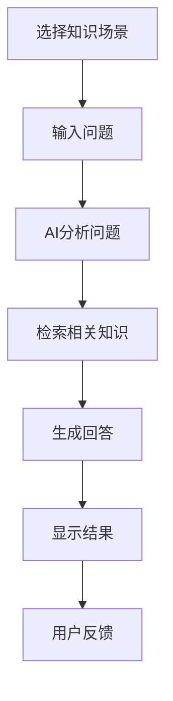

# 👥 棠心问答系统用户手册

> **iChat RAG-QA System User Guide**

[🏠 返回首页](README.md) | [📖 开发者指南](DEVELOP.md) | [📋 项目进度](TODO.md) | [🔧 在线帮助](http://ichat.bisu.edu.cn/help)

## 目录

- [🎯 系统简介](#系统简介)
- [🚀 快速开始](#-快速开始)
- [💬 聊天功能](#-聊天功能)
- [📚 知识场景](#-知识场景)
- [📱 微信小程序](#-微信小程序)
- [👤 个人中心](#-个人中心)
- [⚙️ 系统设置](#️系统设置)
- [❓ 常见问题](#-常见问题)
- [🔧 故障排除](#-故障排除)
- [📞 技术支持](#-技术支持)

## 🎯 系统简介

### 什么是棠心问答？

**棠心问答** 是北京第二外国语学院官方推出的智能问答系统，基于先进的 **RAG (检索增强生成)** 技术，为全校师生提供准确、专业的智能问答服务。

### 主要特色

- **🎓 专业可靠**: 整合校园官方资源，信息准确权威
- **🔍 智能检索**: 毫秒级语义搜索，快速找到相关信息
- **💬 自然对话**: 支持多轮对话，理解上下文语境
- **📚 场景化服务**: 6大知识场景，针对性专业回答
- **📱 多端使用**: 支持Web端和微信小程序
- **🔒 安全保障**: 仅限校园网使用，保护用户隐私

### 适用对象

- **在校学生**: 课程学习、生活咨询、办事指导
- **教职员工**: 教学辅助、科研支持、行政服务
- **管理人员**: 政策查询、数据统计、工作指导

## 🚀 快速开始

### 访问方式

#### Web端访问

1. **浏览器访问**
   - 打开任意现代浏览器 (Chrome、Firefox、Safari、Edge)
   - 访问地址: https://ichat.bisu.edu.cn
   - 或在校园网内搜索"棠心问答"

2. **登录系统**
   - 使用校园网账号密码登录
   - 首次使用需要注册个人信息

#### 微信小程序访问

1. **搜索小程序**
   - 打开微信，点击"搜索"
   - 输入"棠心问答"或扫描二维码
   - 点击"进入小程序"

2. **授权登录**
   - 允许微信授权
   - 验证校园网身份
   - 完成个人信息设置

### 首次使用

#### 1. 注册账号


#### 2. 完善个人信息

- **基本信息**: 姓名、院系、年级/职位
- **兴趣标签**: 选择感兴趣的知识领域
- **通知设置**: 设置消息推送偏好

#### 3. 开始对话



## 💬 聊天功能

### 基础对话

#### 发送消息

1. **文本输入**
   - 在输入框中输入您的问题
   - 支持中英文混合输入
   - 单条消息最多1000字符

2. **发送方式**
   - 点击"发送"按钮
   - 按 `Ctrl + Enter` 快捷键 (Web端)
   - 点击"回车"键 (小程序)

3. **消息示例**
   ```
   问: 请问图书馆的开馆时间是什么？
   答: 根据最新通知，图书馆开馆时间为：
   - 周一至周五: 8:00-22:00
   - 周末: 9:00-21:00
   - 节假日: 10:00-18:00

   来源: 《图书馆服务指南》2024年版
   ```

### 对话技巧

#### 有效提问

**好的提问方式** ✅
- "请问申请奖学金需要满足哪些条件？"
- "我想了解学生社团的申请流程"
- "能帮我查一下明天天气情况吗？"

**需要改进的提问方式** ❌
- "奖学金" (过于简单)
- "怎么办？" (缺乏上下文)
- "123" (无意义内容)

#### 获取更准确回答

1. **提供详细信息**
   ```
   差: "食堂怎么样？"
   好: "一食堂的菜品价格如何？有什么特色菜？"
   ```

2. **指定知识场景**
   ```
   差: "我想入党"
   好: 在"思政学习空间"场景中询问入党的流程和要求
   ```

3. **使用完整句子**
   ```
   差: "宿舍 网络"
   好: "学生宿舍如何连接校园网络？"
   ```

### 多轮对话

#### 上下文理解

系统支持多轮对话，能够理解上下文语境：

```
用户: 请问学校有哪些学生社团？

系统: 学校目前有60多个学生社团，主要分为以下几类：
- 学术类：数学建模协会、英语俱乐部等
- 文艺类：合唱团、舞蹈队、摄影协会等
- 体育类：篮球社、足球社、羽毛球社等
- 公益类：志愿者协会、环保社等

用户: 那么学术类社团如何申请加入呢？

系统: 学术类社团的申请流程通常如下：
1. 关注社团招新通知（一般在9月）
2. 填写申请表格
3. 参加面试或笔试
4. 缴纳会费（一般为20-50元/年）
5. 参加入社培训

具体要求因社团而异，建议直接联系相关社团负责人。
```

#### 历史记录查看

- **Web端**: 点击右侧"历史记录"面板
- **小程序**: 点击底部"历史"标签
- **功能**: 查看所有对话记录，支持搜索和导出

### 消息类型

#### 文本消息
- 支持中英文、数字、标点符号
- 自动识别链接和邮箱
- 支持表情符号

#### 富文本响应
- **Markdown格式**: 支持列表、表格、代码块
- **链接点击**: 可点击查看参考文档
- **来源标注**: 显示信息来源和可靠性

## 📚 知识场景

### 场景概览

| 场景 | 图标 | 描述 | 适用人群 |
|------|------|------|----------|
| **通用助手** | 🎓 | 综合问答助手，覆盖各个方面 | 全体用户 |
| **思政学习空间** | 📚 | 思想政治教育资源和党建知识 | 学生、党员 |
| **学习指导** | 📖 | 学习方法、课程辅导、考试指导 | 学生 |
| **智慧思政** | 💡 | 智能化思政教育平台 | 全体用户 |
| **科研辅助** | 🔬 | 科研方法、论文写作、项目申报 | 教师、研究生 |
| **网上办事厅** | 🏢 | 校园行政服务和办事指南 | 全体用户 |

### 场景切换

#### Web端操作

1. **左侧边栏**: 点击场景图标
2. **下拉菜单**: 在聊天界面顶部选择
3. **快速切换**: 使用快捷键 `Alt + 1-6`

#### 小程序操作

1. **底部标签**: 点击"场景"按钮
2. **场景列表**: 滑动选择目标场景
3. **快速入口**: 首页快捷方式

### 场景特色

#### 思政学习空间 📚

**包含内容**:
- 党的理论知识
- 时事政治解读
- 思想品德教育
- 校园文化活动

**使用示例**:
```
问: 什么是社会主义核心价值观？

答: 社会主义主义核心价值观包括：
国家层面：富强、民主、文明、和谐
社会层面：自由、平等、公正、法治
个人层面：爱国、敬业、诚信、友善

这些价值是中国特色社会主义的本质要求，体现了社会主义的本质要求。

来源: 《社会主义核心价值观学习纲要》
```

#### 学习指导 📖

**包含内容**:
- 课程学习方法
- 考试复习技巧
- 时间管理建议
- 学习资源推荐

**使用示例**:
```
问: 如何提高英语口语水平？

答: 提高英语口语的建议方法：
1. 每日练习：每天至少说英语30分钟
2. 跟读模仿：听录音并跟读，注意语音语调
3. 角色扮演：与同学进行英语对话练习
4. 观看原声：看英语电影、视频，培养语感
5. 参加活动：加入英语角、辩论社等

推荐资源：学校英语角、多邻国App、BBC Learning English

来源: 《大学英语学习指南》
```

#### 科研辅助 🔬

**包含内容**:
- 科研方法论
- 论文写作指导
- 基金申请技巧
- 学术规范要求

**使用示例**:
```
问: 如何撰写高质量的学术论文？

答: 高质量学术论文的撰写要点：
1. 选题创新：选择有研究价值和意义的课题
2. 文献综述：全面了解国内外研究现状
3. 方法科学：采用合适的研究方法和技术路线
4. 数据可靠：确保实验数据的真实性和可重复性
5. 结论清晰：明确研究贡献和创新点

格式要求：遵循目标期刊的投稿指南，注意参考文献格式

来源: 《学术论文写作规范》
```

## 📱 微信小程序

### 校园网验证

#### 访问限制

为保护用户隐私和数据安全，微信小程序仅限校园网内使用：

1. **自动检测**: 小程序启动时自动检测网络环境
2. **多重验证**: IP地址、GPS定位、API连通性验证
3. **访问控制**: 非校园网用户将看到访问限制页面

#### 验证方式

| 验证方式 | 说明 | 适用情况 |
|--------|------|----------|
| **IP地址验证** | 检查是否在校园网段范围内 | WiFi连接 |
| **GPS定位验证** | 验证用户是否在校园地理范围内 | 移动网络 |
| **API连通性验证** | 测试与校内服务器的连接 | 所有网络 |

### 小程序功能

#### 主要界面

1. **首页**: 快速入口和推荐问题
2. **聊天**: 核心问答功能
3. **场景**: 知识场景选择
4. **历史**: 对话记录查看
5. **我的**: 个人设置和账户管理

#### 特色功能

- **语音输入**: 支持语音转文字
- **图片识别**: 识别图片中的文字内容
- **消息通知**: 接收系统推送和回答通知
- **离线缓存**: 部分内容支持离线查看

### 使用指南

#### 语音输入

1. **点击麦克风图标**
2. **说出您的问题**
3. **松开发送**
4. **系统自动转换为文字并发送**

支持语言：
- 中文普通话
- 英语（部分功能）
- 语音识别准确率 > 95%

#### 图片识别

1. **点击相机图标**
2. **选择或拍摄图片**
3. **系统识别文字内容**
4. **基于图片内容回答问题**

支持格式：
- JPEG、PNG图片
- 最大文件大小：10MB
- 识别准确率 > 90%

## 👤 个人中心

### 账户管理

#### 个人信息

**基本信息**:
- 姓名、学号/工号
- 院系、专业/部门
- 年级/职位、联系方式

**修改流程**:
1. 进入"个人中心"
2. 点击"编辑资料"
3. 修改需要更新的信息
4. 点击"保存"提交

#### 安全设置

**密码修改**:
```
当前密码: ********
新密码: ********
确认新密码: ********
```

**安全建议**:
- 使用强密码（8位以上，包含数字、字母、符号）
- 定期更换密码（建议3个月一次）
- 不要与他人分享账号信息

### 使用统计

#### 对话统计

- **总对话次数**: 显示历史对话总数
- **常用场景**: 展示最常使用的知识场景
- **活跃时间段**: 分析您的使用时间分布

#### 使用建议

基于您的使用习惯，系统会提供个性化建议：

```
您的使用分析：
- 最常用场景：学习指导 (45%)
- 活跃时间：晚上8-10点
- 平均对话长度：3-5轮

建议：
1. 可以尝试使用"科研辅助"场景获取更多信息
2. 关注我们的每日推送，获取最新校园资讯
3. 参与用户反馈，帮助我们改进服务质量
```

### 反馈建议

#### 反馈方式

1. **意见反馈表**
   - 在"个人中心"点击"意见反馈"
   - 填写反馈类型和详细内容
   - 提交后我们会及时处理

2. **评分系统**
   - 每次对话后可对回答进行评分
   - 评分范围：1-5星
   - 您的评分有助于我们改进服务质量

#### 反馈类型

| 反馈类型 | 描述 | 处理时间 |
|----------|------|----------|
| **功能建议** | 新功能需求或改进建议 | 3-5个工作日 |
| **内容纠错** | 回答内容不准确或过时 | 1-2个工作日 |
| **系统故障** | 程序错误或无法正常使用 | 24小时内 |
| **使用咨询** | 操作方法或功能说明 | 1个工作日 |

## ⚙️ 系统设置

### 通知设置

#### 推送通知

**通知类型**:
- 回答完成通知
- 系统维护通知
- 新功能上线通知
- 个性化推荐内容

**设置方式**:
1. 进入"个人中心"
2. 点击"通知设置"
3. 选择需要接收的通知类型
4. 设置接收时间段

#### 邮件通知

**邮件内容**:
- 对话摘要报告
- 重要系统公告
- 个人使用统计

**订阅设置**:
- 每日摘要：每天晚上9点发送当日对话摘要
- 每周报告：每周一发送上周使用统计
- 重要通知：系统重要变更即时通知

### 隐私设置

#### 数据隐私

**收集的信息**:
- 对话记录（用于服务质量改进）
- 使用偏好（用于个性化推荐）
- 技术信息（IP地址、设备信息等）

**隐私保护**:
- 所有对话记录加密存储
- 不会与第三方共享个人信息
- 支持导出和删除个人数据

#### 对话记录管理

**查看历史**:
- 按时间查看所有对话
- 按场景筛选对话记录
- 搜索特定关键词

**数据导出**:
- 支持导出JSON格式
- 包含完整的对话历史
- 可用于备份或分析

**数据删除**:
- 删除单条对话记录
- 清空所有历史记录
- 删除后无法恢复

### 显示设置

#### 界面主题

**Web端主题**:
- 浅色主题（默认）
- 深色主题（护眼模式）
- 自动切换（跟随系统设置）

**字体设置**:
- 字体大小：小、中、大、特大
- 字体系列：系统默认、微软雅黑、思源黑体
- 行间距：紧凑、标准、宽松

#### 语言设置

**界面语言**:
- 简体中文（默认）
- English（Beta版本）

**回答语言**:
- 中文回答（默认）
- 英文回答（部分场景）
- 中英混合（自动选择）

## ❓ 常见问题

### 账户问题

**Q: 忘记密码怎么办？**

A: 可以通过以下方式重置密码：
1. 点击登录页面的"忘记密码"
2. 输入学号/工号和注册邮箱
3. 查收重置密码邮件
4. 按照邮件指引设置新密码

**Q: 可以修改个人信息吗？**

A: 可以。在"个人中心"可以修改：
- 联系方式（邮箱、手机号）
- 院系专业信息
- 通知偏好设置
- 修改后需要重新登录生效

**Q: 账号会被锁定吗？**

A: 在以下情况下账号可能被临时锁定：
- 连续5次密码错误
- 检测到异常登录行为
- 违反使用规定

锁定时间：30分钟，之后自动解锁。如需立即解锁，请联系管理员。

### 使用问题

**Q: 为什么有时候回答很慢？**

A: 回答延迟可能的原因：
- 网络连接不稳定
- 系统负载较高（使用高峰期）
- 问题复杂需要更多处理时间

建议：
- 检查网络连接
- 避开使用高峰期（12:00-14:00，18:00-22:00）
- 尝试简化问题表述

**Q: 如何获得更准确的回答？**

A: 提高回答质量的技巧：
1. **明确问题**: 使用完整、具体的描述
2. **选择合适场景**: 根据问题类型选择对应知识场景
3. **提供背景信息**: 给出相关的上下文
4. **分步提问**: 复杂问题可以分多个步骤询问

**Q: 系统支持哪些文件格式？**

A: 当前支持的文件格式：
- 文档：PDF、DOCX、TXT、Markdown
- 图片：JPEG、PNG、GIF（用于识别文字）
- 音频：MP3、WAV（语音输入）

单文件大小限制：10MB

### 内容问题

**Q: 回答的准确性如何保证？**

A: 我们的准确性保证机制：
1. **权威来源**: 使用学校官方文件和资料
2. **实时更新**: 定期更新知识库内容
3. **多重验证**: 交叉验证多个信息源
4. **人工审核**: 重要内容经过专家审核

如果发现回答有误，请通过"意见反馈"告诉我们，我们会及时核实和修正。

**Q: 可以建议新的知识内容吗？**

A: 非常欢迎！您可以通过：
1. 在对话中提出需要的信息
2. 发送邮件到：content@ichat.bisu.edu.cn
3. 在"意见反馈"中详细说明

我们会认真考虑每一条建议。

**Q: 系统会记录我的对话吗？**

A: 是的，系统会记录：
- 对话内容（用于服务质量改进）
- 使用时间和场景
- 用户反馈信息

这些信息：
- 加密存储，保护隐私
- 仅用于系统优化
- 不会与第三方共享
- 您可以随时删除

## 🔧 故障排除

### 常见技术问题

#### Web端问题

**页面加载失败**

1. **检查网络连接**
   ```bash
   # 测试网络连接
   ping ichat.bisu.edu.cn
   ```

2. **清除浏览器缓存**
   - Chrome: Ctrl+Shift+Delete
   - Firefox: Ctrl+Shift+Delete
   - Safari: Command+Option+E

3. **尝试其他浏览器**
   - 推荐使用Chrome、Firefox、Edge最新版本

**无法登录**

1. **检查账号密码**
   - 确认学号/工号正确
   - 检查大小写和特殊字符

2. **检查网络环境**
   - 确保在校园网内
   - 尝试重启路由器

3. **联系管理员**
   - 邮箱：admin@ichat.bisu.edu.cn
   - 电话：010-12345678

#### 小程序问题

**网络验证失败**

1. **检查网络设置**
   - 确保连接校园WiFi
   - 开启GPS定位服务

2. **重启小程序**
   - 完全关闭微信
   - 重新打开小程序

3. **更新小程序**
   - 删除小程序
   - 重新搜索并添加

**功能异常**

1. **清理缓存**
   ```
   微信 > 我 > 设置 > 通用 > 存储空间 > 清理缓存
   ```

2. **更新微信版本**
   - 确保微信版本 >= 8.0
   - 前往应用商店更新

### 性能优化建议

#### 提升使用体验

1. **网络优化**
   - 使用有线网络连接
   - 避开网络高峰期
   - 关闭其他占用带宽的应用

2. **设备优化**
   - 关闭不必要的后台应用
   - 定期清理设备存储空间
   - 保持设备软件更新

3. **浏览器优化**
   - 启用硬件加速
   - 禁用不必要的插件
   - 定期清理浏览器数据

## 📞 技术支持

### 联系方式

#### 服务时间

- **在线客服**: 工作日 9:00-18:00
- **邮件支持**: 24小时内回复
- **紧急故障**: 2小时内响应

#### 联系渠道

| 渠道 | 说明 | 响应时间 |
|------|------|----------|
| **在线客服** | 系统内置聊天功能 | 实时 |
| **服务邮箱** | support@ichat.bisu.edu.cn | 24小时内 |
| **服务热线** | 010-12345678 | 工作日 9:00-18:00 |
| **微信群** | 扫描二维码加入用户群 | 实时交流 |

#### 现场支持

**IT服务台**:
- 地点：图书馆一楼信息中心
- 时间：工作日 8:30-17:30
- 服务：账号问题、网络故障、设备支持

**用户培训**:
- 定期举办使用培训会
- 提供操作手册和视频教程
- 支持院系专场培训

### 学习资源

#### 使用教程

1. **视频教程**
   - 系统介绍和使用指南
   - 各功能模块详细说明
   - 常见问题解决方法

2. **图文教程**
   - 详细的操作步骤
   - 截图和文字说明
   - 实际案例演示

3. **FAQ文档**
   - 最新的常见问题解答
   - 系统更新说明
   - 使用技巧分享

#### 社区交流

**用户论坛**:
- https://forum.ichat.bisu.edu.cn
- 用户经验分享
- 功能建议讨论
- 技术问题互助

**微信公众号**:
- 搜索"棠心问答"
- 系统通知和更新
- 使用技巧推送
- 线上活动报名

---

## 📚 附录

### 术语解释

| 术语 | 说明 |
|------|------|
| **RAG** | Retrieval-Augmented Generation，检索增强生成 |
| **向量数据库** | 存储和检索文本向量的专用数据库 |
| **知识场景** | 按知识领域分类的问答模块 |
| **语义搜索** | 基于内容含义而非关键词的搜索技术 |

### 快捷键参考

#### Web端快捷键

| 快捷键 | 功能 |
|--------|------|
| `Ctrl + Enter` | 发送消息 |
| `Alt + 1-6` | 切换知识场景 |
| `Ctrl + /` | 显示快捷键帮助 |
| `Esc` | 关闭弹窗 |
| `Ctrl + H` | 打开历史记录 |

#### 小程序手势

| 手势 | 功能 |
|------|------|
| **左滑** | 删除对话记录 |
| **长按** | 复制消息内容 |
| **双击** | 快速点赞 |
| **下拉** | 刷新界面 |

### 版本历史

| 版本 | 日期 | 更新内容 |
|------|------|----------|
| v1.2.0 | 2024-12-08 | 新增科研辅助场景，优化检索算法 |
| v1.1.0 | 2024-11-15 | 添加微信小程序，支持语音输入 |
| v1.0.0 | 2024-10-01 | 系统正式上线，基础功能完善 |

---

**[⬆ 返回顶部](#-棠心问答系统用户手册)**

Made with ❤️ by 北京第二外国语学院信息化办公室

**感谢您使用棠心问答系统！**